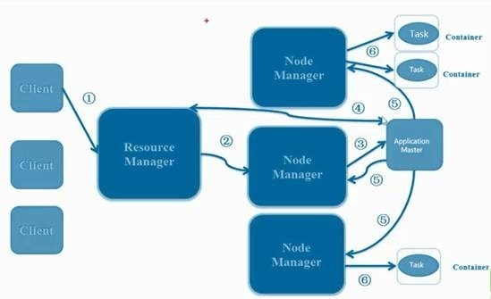
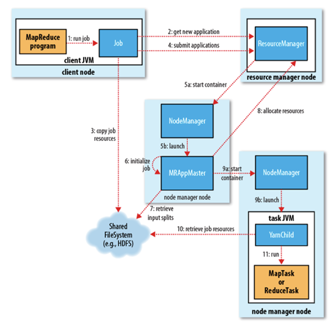

# Yarn

## 一、简介

### 1.1 背景

从业界使用分布式系统的变化趋势和 hadoop 框架的长远发展来看，MapReduce的 JobTracker/TaskTracker 机制需要大规模的调整来修复它在可扩展性，内存消耗，线程模型，可靠性和性能上的缺陷。在过去的几年中，hadoop 开发团队做了一些 bug 的修复，但是这些修复的成本越来越高，这表明对原框架做出改变的难度越来越大。为从根本上解决旧MapReduce框架的性能瓶颈，促进 Hadoop 框架的更长远发展，从 0.23.0 版本开始，Hadoop 的 MapReduce 框架完全重构，发生了根本的变化。新的 Hadoop MapReduce 框架命名为 MapReduceV2 或者叫 Yarn。

YARN是从0.23.0版本开始新引入的资源管理系统，直接从MR1（0.20.x、0.21.x、0.22.x）演化而来，其核心思想:

将MR1中JobTracker的资源管理和作业调用两个功能分开，分别由ResourceManager和ApplicationMaster进程来实现

* ResourceManager：负责整个集群的资源管理和调度
* ApplicationMaster：负责应用程序相关事务，比如任务调度、任务监控和容错等

### 1.2 为什么使用Yarn？

与旧 MapReduce 相比，YARN 采用了一种分层的集群框架，它解决了旧MapReduce 一系列的缺陷，具有以下几种优势。

* 提出了HDFS Federation，它让多个NameNode分管不同的目录进而实现访问隔离和横向扩展。对于运行中NameNode的单点故障，通过 NameNode热备方案（NameNode HA）实现
* YARN通过将资源管理和应用程序管理两部分分剥离开，分别由ResouceManager和ApplicationMaster负责，其中，ResouceManager专管资源管理和调度，而ApplicationMaster则负责与具体应用程序相关的任务切分、任务调度和容错等，每个应用程序对应一个ApplicationMaster
* YARN具有向后兼容性，用户在MRv1上运行的作业，无需任何修改即可运行在YARN之上。
* 对于资源的表示以内存为单位 (在目前版本的Yarn中，没有考虑 cpu 的占用 )，比之前以剩余 slot 数目更合理。
* 支持多个框架， YARN不再是一个单纯的计算框架，而是一个框架管理器，用户可以将各种各样的计算框架移植到YARN之上，由YARN进行统一管理和资源分配。目前可以支持多种计算框架运行在YARN上面，比如MapReduce、Storm、Spark、Flink等
* 框架升级更容易， 在YARN中，各种计算框架不再是作为一个服务部署到集群的各个节点上（比如MapReduce框架，不再需要部署JobTracler、 TaskTracker等服务），而是被封装成一个用户程序库（lib）存放在客户端，当需要对计算框架进行升级时，只需升级用户程序库即可，多么容易！

## 二、原理

### 2.1 组成及架构

#### 2.1.1 基本组成

 

从 YARN 的架构图来看，它主要由ResourceManager、NodeManager、ApplicationMaster和Container等以下几个组件构成。 

**ResourceManager（RM）**

YARN 分层结构的本质是 ResourceManager。这个实体控制整个集群并管理应用程序向基础计算资源的分配。ResourceManager 将各个资源部分（计算、内存、带宽等）精心安排给基础 NodeManager（YARN 的每节点代理）。ResourceManager 还与 ApplicationMaster 一起分配资源，与 NodeManager 一起启动和监视它们的基础应用程序。在此上下文中，ApplicationMaster 承担了以前的 TaskTracker 的一些角色，ResourceManager 承担了 JobTracker 的角色。

作用：
* 1、处理客户端请求
* 2、启动或监控ApplicationMaster
* 3、监控NodeManager
* 4、资源的分配与调度

**ApplicationMaster（AM）**

ApplicationMaster 管理在YARN内运行的每个应用程序实例。ApplicationMaster 负责协调来自 ResourceManager 的资源，并通过 NodeManager 监视容器的执行和资源使用（CPU、内存等的资源分配）。请注意，尽管目前的资源更加传统（CPU 核心、内存），但未来会带来基于手头任务的新资源类型（比如图形处理单元或专用处理设备）。从 YARN 角度讲，ApplicationMaster 是用户代码，因此存在潜在的安全问题。YARN 假设 ApplicationMaster 存在错误或者甚至是恶意的，因此将它们当作无特权的代码对待。

作用：
* 1、负责数据的切分
* 2、为应用程序申请资源并分配给内部的任务
* 3、任务的监控与容错

**NodeManager（NM）**

NodeManager管理YARN集群中的每个节点。NodeManager 提供针对集群中每个节点的服务，从监督对一个容器的终生管理到监视资源和跟踪节点健康。MRv1 通过插槽管理 Map 和 Reduce 任务的执行，而 NodeManager 管理抽象容器，这些容器代表着可供一个特定应用程序使用的针对每个节点的资源。

作用：
* 1、管理单个节点上的资源
* 2、处理来自ResourceManager的命令
* 3、处理来自ApplicationMaster的命令

**Container**

Container 是 YARN 中的资源抽象，它封装了某个节点上的多维度资源，如内存、CPU、磁盘、网络等，当AM向RM申请资源时，RM为AM返回的资源便是用Container表示的。YARN会为每个任务分配一个Container，且该任务只能使用该Container中描述的资源。

作用：
对任务运行环境进行抽象，封装CPU、内存等多维度的资源以及环境变量、启动命令等任务运行相关的信息。

要使用一个 YARN 集群，首先需要一个包含应用程序的客户的请求。ResourceManager 协商一个容器的必要资源，启动一个 ApplicationMaster 来表示已提交的应用程序。通过使用一个资源请求协议，ApplicationMaster 协商每个节点上供应用程序使用的资源容器。执行应用程序时，ApplicationMaster 监视容器直到完成。当应用程序完成时，ApplicationMaster 从 ResourceManager 注销其容器，执行周期就完成了。

通过上面的讲解，应该明确的一点是，旧的 Hadoop 架构受到了 JobTracker 的高度约束，JobTracker 负责整个集群的资源管理和作业调度。新的 YARN 架构打破了这种模型，允许一个新 ResourceManager 管理跨应用程序的资源使用，ApplicationMaster 负责管理作业的执行。这一更改消除了一处瓶颈，还改善了将 Hadoop 集群扩展到比以前大得多的配置的能力。此外，不同于传统的 MapReduce，YARN 允许使用MPI( Message Passing Interface) 等标准通信模式，同时执行各种不同的编程模型，包括图形处理、迭代式处理、机器学习和一般集群计算。

### 2.2 作业调度流程

 

YARN 的作业运行，主要由以下几个步骤组成：

**1. 作业提交**

client 调用job.waitForCompletion方法，向整个集群提交MapReduce作业 (第1步) 。 新的作业ID(应用ID)由资源管理器分配(第2步). 作业的client核实作业的输出, 计算输入的split, 将作业的资源(包括Jar包, 配置文件, split信息)拷贝给HDFS(第3步). 最后, 通过调用资源管理器的submitApplication()来提交作业(第4步).

**2. 作业初始化**

当资源管理器收到submitApplciation()的请求时, 就将该请求发给调度器(scheduler), 调度器分配container, 然后资源管理器在该container内启动应用管理器进程, 由节点管理器监控(第5步).

MapReduce作业的应用管理器是一个主类为MRAppMaster的Java应用. 其通过创造一些bookkeeping对象来监控作业的进度, 得到任务的进度和完成报告(第6步). 然后其通过分布式文件系统得到由客户端计算好的输入split(第7步). 然后为每个输入split创建一个map任务, 根据mapreduce.job.reduces创建reduce任务对象.

**3. 任务分配**

如果作业很小, 应用管理器会选择在其自己的JVM中运行任务。

如果不是小作业, 那么应用管理器向资源管理器请求container来运行所有的map和reduce任务(第8步). 这些请求是通过心跳来传输的, 包括每个map任务的数据位置, 比如存放输入split的主机名和机架(rack). 调度器利用这些信息来调度任务, 尽量将任务分配给存储数据的节点, 或者分配给和存放输入split的节点相同机架的节点.

**4. 任务运行**

当一个任务由资源管理器的调度器分配给一个container后, 应用管理器通过联系节点管理器来启动container(第9步). 任务由一个主类为YarnChild的Java应用执行. 在运行任务之前首先本地化任务需要的资源, 比如作业配置, JAR文件, 以及分布式缓存的所有文件(第10步). 最后, 运行map或reduce任务(第11步).

YarnChild运行在一个专用的JVM中, 但是YARN不支持JVM重用.

**5. 进度和状态更新**

YARN中的任务将其进度和状态(包括counter)返回给应用管理器, 客户端每秒(通过mapreduce.client.progressmonitor.pollinterval设置)向应用管理器请求进度更新, 展示给用户。

**6. 作业完成**

除了向应用管理器请求作业进度外, 客户端每5分钟都会通过调用waitForCompletion()来检查作业是否完成. 时间间隔可以通过mapreduce.client.completion.pollinterval来设置. 作业完成之后, 应用管理器和container会清理工作状态, OutputCommiter的作业清理方法也会被调用. 作业的信息会被作业历史服务器存储以备之后用户核查。

 

## 三、ResourceManager High Availability

### 3.1 概述

ResourceManager（RM）负责跟踪集群中的资源，以及调度应用程序（例如，MapReduce作业）。在Hadoop 2.4之前，ResourceManager是YARN集群中的单点故障。高可用性功能以Active / Standby ResourceManager对的形式添加冗余，以消除此单点故障。 

### 3.2 架构

 

#### 3.2.1 故障转移(failover)

ResourceManager HA通过active/standby架构实现 - 在任何时间点，其中一个RM处于活动状态，并且一个或多个RM处于待机模式，等待活动发生任何事情时接管。转换为活动的触发器来自管理员（通过CLI）或启用自动故障转移时的集成故障转移控制器。

**手动转换和故障转移**

如果未启用自动故障转移，则管理员必须手动将其中一个RM转换为活动。要从一个RM故障转移到另一个RM，他们应该首先将Active-RM转换为待机状态，并将Standby-RM转换为Active。所有这些都可以使用“ `yarn rmadmin` ”CLI完成。

**自动故障转移**

RM可以选择嵌入基于Zookeeper的ActiveStandbyElector来决定哪个RM应该是Active。当Active关闭或无响应时，另一个RM自动被选为Active，然后接管。请注意，不需要像HDFS那样运行单独的ZKFC守护程序，因为嵌入在RM中的ActiveStandbyElector充当故障检测器和领导者选择器而不是单独的ZKFC守护程序。

**RM故障转移上的客户端，ApplicationMaster和NodeManager**

当有多个RM时，客户端和节点使用的配置（yarn-site.xml）应列出所有RM。客户端，ApplicationMaster（AM）和NodeManagers（NM）尝试以循环方式连接到RM，直到它们到达Active RM。如果活动停止，他们将恢复循环轮询，直到他们点击“新”活动。此默认重试逻辑实现为`org.apache.hadoop.yarn.client.ConfiguredRMFailoverProxyProvider`。您可以通过实现`org.apache.hadoop.yarn.client.RMFailoverProxyProvider`并将`yarn.client.failover-proxy-provider`的值设置为类名来覆盖逻辑。

#### 3.2.2 恢复以前的active-RM状态

随着[ResourceManger重新](https://hadoop.apache.org/docs/r2.9.2/hadoop-yarn/hadoop-yarn-site/ResourceManagerRestart.html)启用，RM被晋升为活动状态负载RM内部状态，并继续从以前的主动离开的地方尽可能多地取决于RM重启功能操作。为先前提交给RM的每个托管应用程序生成一个新尝试。应用程序可以定期检查点，以避免丢失任何工作。必须从主动/备用RM两者中看到状态存储。目前，有两种用于持久性的RMStateStore实现--FileSystemRMStateStore和ZKRMStateStore。该`ZKRMStateStore`隐式允许在任何时间点对单个RM进行写访问，因此是在HA群集中使用的推荐存储。当使用ZKRMStateStore时，不需要单独的防护机制来解决潜在的裂脑情况，其中多个RM可能具有Active角色。使用ZKRMStateStore时，建议不要在Zookeeper群集上设置“ `zookeeper.DigestAuthenticationProvider.superDigest` ”属性，以确保zookeeper admin无权访问YARN应用程序/用户凭据信息。 

### 3.3 配置详情

https://hadoop.apache.org/docs/r2.9.2/hadoop-yarn/hadoop-yarn-site/ResourceManagerHA.html#Deployment

